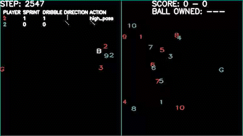

# Rainbow DQN for Google football game

- It is part of a project in Reinforcement Learning (AIE6203-01).
- Implementation of [RainbowDQN](https://arxiv.org/abs/1710.02298) with reinforcement library `prfl` for [Google Research Football](https://github.com/google-research/football).
- Most part of our codes originate from [pfrl](https://github.com/pfnet/pfrl) and [Google Research Football](https://github.com/google-research/football).

## Results
<div align="center">
  
</div>
<br>

- Please follow this [LINK](https://www.youtube.com/watch?v=Wz08u-gISgU) if you want to see qualitative results.

## Hyperparameters

Information on all these hyperparameters and performances is reported [HERE](https://docs.google.com/spreadsheets/d/19rK_Cw2WnamJdTDXWr_wK27oPcm3C_IL5m1AfT8d_hM/edit?usp=sharing).

## Dependencies
Please run the following command for environments.

```shell
pip install pfrl==0.1.0
pip install gym==0.22
pip install dataframe_image
apt-get update
apt-get install libboost1.65-all -y
apt update
apt install chromium-chromedriver -y
```

Also run the following command to download the `gfootball` environment.
```shell
mkdir -p football/third_party/gfootball_engine/lib
wget https://storage.googleapis.com/gfootball/prebuilt_gameplayfootball_v2.7.so -O football/third_party/gfootball_engine/lib/prebuilt_gameplayfootball.so
cd football && GFOOTBALL_USE_PREBUILT_SO=1 pip install .
```

## Pretrained Model

The pretrained models of ours and default models are exist in [HERE](https://drive.google.com/drive/folders/1t-2DkWumwGBP3NVFPgadJsW3yOnXyIDA?usp=share_link).


